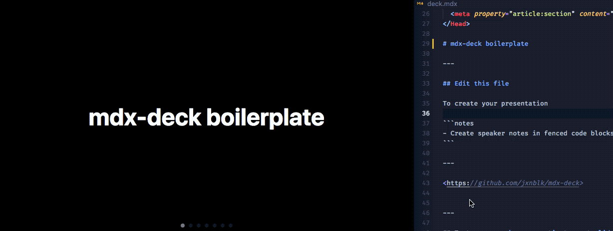

#guiafoca

Guia Foca Linux
================

Este é o repositório oficial do Guia Foca Linux. O guia Foca existe desde 1999
e é de longe o mais utilizado tanto para quem está dando os primeiros passos
no Linux quanto por usuários experientes e que desejam realizar configurações
mais complexas nos serviços do sistema.

Você pode enviar as contribuições de melhoria fazendo o clone do repositório 
e enviando push request.

Gleydson Mazioli da Silva - <gleydsonmazioli@gmail.com>




Se você quer compilar manualmente o Guia Foca, a primeira coisa que precisa fazer é 
baixar o docbook-xml, docbook-xsl e xsltproc e instalar em sua máquina (em variantes usando deb). 

Em seguida, precisará aplicar o comando de pre-processamento como o seguinte:

$ xsltproc --output guiafoca-out.md --xinclude --stringparam profile.userlevel "inic" --stringparam profile.condition "web;obs;descricaod;capjuntos;debian" --stringparam profile.role "strong" --stringparam body.font.family Helvetica --stringparam body.font.master 11  /usr/share/xml/docbook/stylesheet/docbook-xsl/profiling/profile.xsl index.md

E em seguida o comando para gerar o formato de saída HTML:

$ xsltproc --output index.html /usr/share/xml/docbook/stylesheet/docbook-xsl/html/onechunk.xsl guiafoca-out.md

Outros formatos podem ser gerados a partir do fonte, basta consultar a documentação
de autoria de livros do Docbook para maiores detalhes:


http://docbook.org


# mdx-deck Template

A basic boilerplate to use with [mdx-deck](https://github.com/jxnblk/mdx-deck) with all components and layouts. Different themes and configurations available as feature branches.

[](https://app.netlify.com/start/deploy?repository=https://github.com/whoisryosuke/mdx-deck-netlify)

## Features

Swap to different themes and configurations by building feature branches (or checkout + merge with production branch).

* [⚫ Dark theme](https://github.com/whoisryosuke/mdx-deck-netlify/tree/feat/dark-theme)
* [🌈 Syntax Highlighting with Theming](https://github.com/whoisryosuke/mdx-deck-netlify/tree/feat/syntax-highlight)

## Development

To run the presentation deck in development mode:

```sh
npm start
```

Edit the [`deck.mdx`](deck.mdx) file to get started.

## Exporting

To build the presentation deck as static HTML:

```sh
npm run build
```

To export a PDF:

```sh
npm run pdf
```

To export an image of the title slide:

```sh
npm run image
```

For more documentation see the [mdx-deck][] repo.

[mdx-deck]: https://github.com/jxnblk/mdx-deck

## Deploy

### Netlify

1. Clone the project locally and add to your Github
1. Add the repo to Netlify

or

1. Click deploy to Netlify on the example repo

## ⚙️ Netlify settings

In order to make sure our deck deploys properly using continuous integration, we have to configure Netlify to build and display our app.  

Go to your Deploy Settings (under the Deploys tab in your Netlify project/repo) and add the following settings:

1. Set the build script to `npm run build`
1. Set the deploy folder to `dist`

We give Netlify a build script to run each time we make a commit to the repo. And the deploy folder is the place where mdx-deck exports the static HTML/JS version, and by pointing Netlify there it displays our deck after building.

[See the demo site here](https://dazzling-kepler-4cc40d.netlify.com/)

## Credits

* [mdx-deck](https://github.com/jxnblk/mdx-deck) by [@jxnblk](https://github.com/jxnblk)
